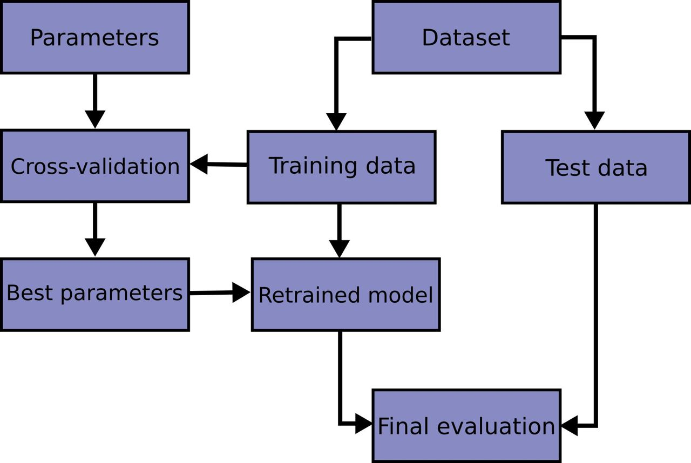

# BrainAge

This repository belongs to Angela Corvino and Agata Minnocci. It contains our exam project for the course of Computing Methods for Experimental Physics and Data Analysis.

The aim of our project is to implement an algorithm that has the ability to predict brain age analysing features extracted from brain MRIs of a cohort of subjects with Autism Spectrum Disorder and controls. The algorithm will:
-implent a data harmonization system
-look for possible outliers 
-compare different regression models and evaluate their performance.

## Data

The features are contained in a .csv file in the BrainAge/data folder.
This dataset contains 419 brain morphological features (volumes, thickness, area, etc.) of brain parcels and global measure, computed by means of the [FreeSurfer](https://surfer.nmr.mgh.harvard.edu/) segmentation software for 915 male subjects of the [ABIDE I dataset](http://fcon_1000.projects.nitrc.org/indi/abide/). ABIDE stands for Autism Brain Imaging Data Exchange.
The features were computed by means of the FreeSurfer segmentation software. A subsample of the large amount of features generated by Freesurfer for the ABIDE I data cohort is analyzed.

## Data Harmonization 

To mitigate the effect of the different acquisition sites on the features, we have to harmonize data across sites. 

We define harmonization as the explicit removal of site-related effects in multi-site data (cit [Pomponio](https://www.sciencedirect.com/science/article/pii/S1053811919310419?via%3Dihub#!))

For the removal of site effects, different harmonization procedures were compared:
(i) absence of harmonization ;
(ii) removal of site effects using ComBat with age as biological covariate of interest (age covariate);
(iii) removal of site effects using ComBat without specifying (preserving) the age as a biological covariate 
(iv) removal of site effects using neuroHarmonize  specifying the age as a biological covariate.

Why do we have to use the age as covariate ?
We have to consider the interaction between the site variable and the age of the subjects.
If some sites only include subjects with age in specific ranges( this is our case) , it is therefore important to ensure that the harmonization of the site effect does not affect the age-related biological variability of the dataset.

the Combat model we are going to use has been implemented in python by [Fortin et al.](https://www.sciencedirect.com/science/article/abs/pii/S105381191730931X)

The neuroHarmonize model provides similar functionality respect to Combat but has  additional features:

-Separate train/test datasets.
-Specify covariates with generic nonlinear effects. Implemented using Generalized Additive Models (GAMs) from the statsmodels package.
-Skip the empirical Bayes (EB) step of ComBat, if desired.

## Outliers
Various statistical criteria exist for the classification of multivariate outliers , but the majority of them requires the knowledge of the feature distributions (e.g. Mahalanobis’ distance, Cook’s distance), while the distributions of the anatomical brain feature values are not a priori known and are not easily understandable from the data (Ferrari et al.)

One of the most commonly used tools in determining outliers is the Z-score. Z-score is just the number of standard deviations away from the mean that a certain data point is.
It is also possible to use the Interquartile Range to Create Outlier Fences.

For our application, we adapted the autoencoder described by S. Hawkins et alt. (https://link.springer.com/content/pdf/10.1007/3-540-46145-0_17.pdf) to our data, building a symmetric, four-linear-layer network with N = 424 (the number of features under examination). The three inner layers have 30, 2 and 30 neurons respectively, their activation functions are a hyperbolic tangent, a step-wise function and a hyperbolic tangent again. The fourth layer generates an output with the same dimensions as the input and a sigmoid filter maps the output into the final vector. We trained the autoencoder comparing the output vector with the input features using the Mean Squared Error (MSE) as the loss function.
 
 
## Features Selection

Several feature selection techniques can be applied to remove irrelevant, noisy, and redundant features, avoiding overfitting and improving prediction performance, reducing the computational complexity of the learning algorithm, and proving a deeper insight into the data, which highlights which of the features are most informative for age prediction [An Introduction to Variable and Feature Selection](https://www.jmlr.org/papers/volume3/guyon03a/guyon03a.pdf?ref=driverlayer.com/web)

## k-fold Cross validation
Cross Validation. Cross validation works by splitting our dataset into random groups, holding one group out as the test, and training the model on the remaining groups. This process is repeated for each group being held as the test group, then the average of the models is used for the resulting model.
One of the most common types of cross validation is k-fold cross validation, where ‘k’ is the number of folds within the dataset.

K-fold cross validation is implemented every time we want to evaluate the performance of the estimator. In particular we choose to use Stratified k-fold in order to preserve the class distribution in the dataset when creating  training and test splits.
 This means that if, for example, the ratio of <20 years subjects (class0) to >20 years (class1) subject is 1/3, then each datasets  include 3x data points from class1 and x data point from class 0.
 
 ## Hyperparameters Tuning with Grid Search
 Grid search is the simplest algorithm for hyperparameter tuning. Basically, we divide the domain of the hyperparameters into a discrete grid. Then, we try every combination of values of this grid, calculating some performance metrics using cross-validation. The point of the grid that maximizes the average value in cross-validation, is the optimal combination of values for the hyperparameters.
 

## Requirements

To use our Python codes the following packages are needed: numpy, scikit-learn, seaborn, pandas, matplotlib, scipy, neuroHarmonize  and  neuroCombat.
## How to use

#Step1 : Clone
Clone the directory 

#Step2 : Compare model on control subjects and use the best performing model on autistic subjects 

Run the Python code modelcomparison.py to
- peform data preprocessing ( self normalization and data harmonization ) 
- predic the age of healthy subjects comparing different regression models and a deep model.
- find the best estimator (combination of model and hyperparametrs ) 
- use the best performing model (best estimator) to predict the age of autistic subjects
